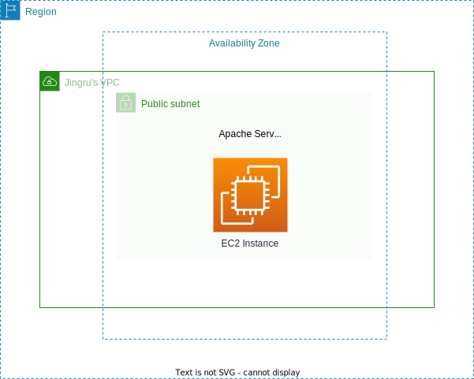
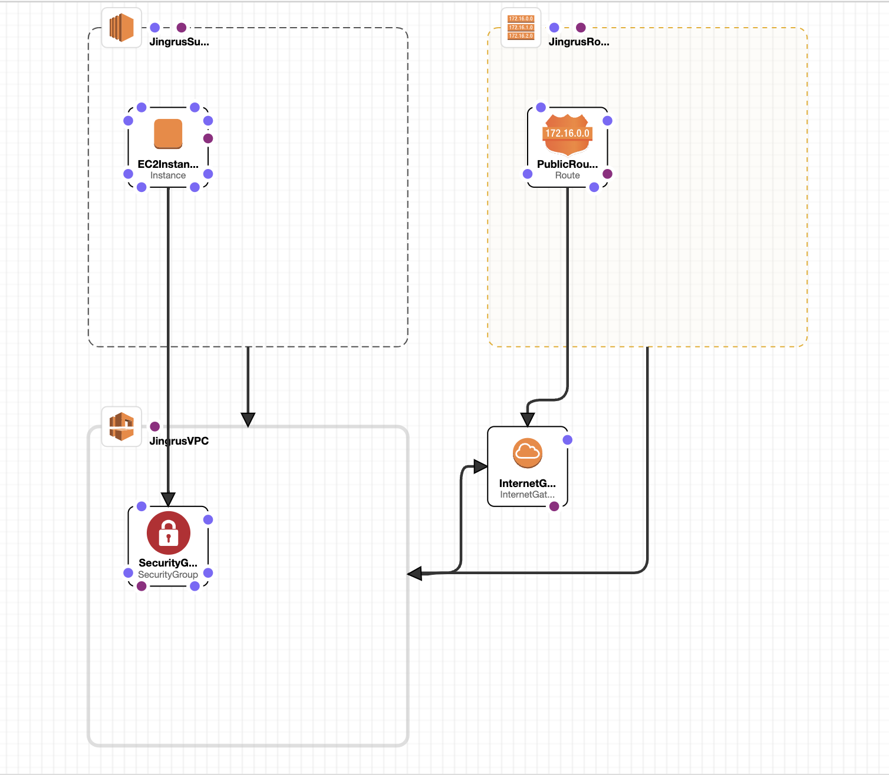
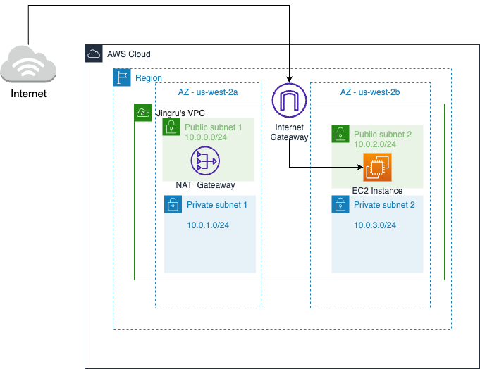
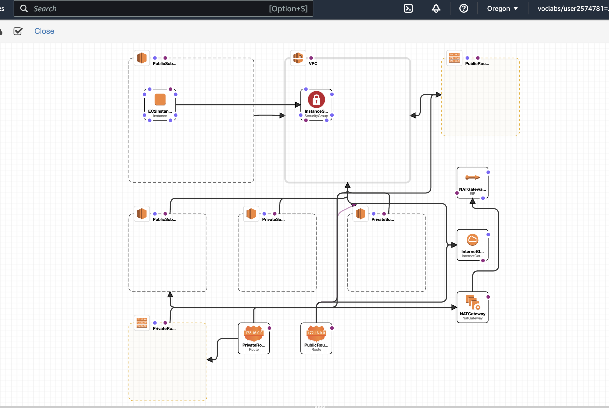

# AWS-CloudFormation

### Create `Lab 11` stack using CloudFormation Template

| draw.io                         | CloudFormation Designer              |
| ----------------------------------------- | -----------------------------------   |
|  |  | 

### Create `Lab 267` stack using CloudFormation Template 

🚀🚀🚀 To make web page show up, go to `VPC -> Route tables -> Public Route Table & Private Route Table -> Edit subnet associations` to associcate corresponding subnets 

| draw.io                         | CloudFormation Designer              |
| ----------------------------------------- | -----------------------------------   |
|  |  | 
