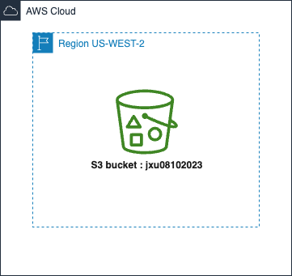

# AWS-CloudFormation

### Create `Lab 11` stack using CloudFormation Template

| draw.io                         | CloudFormation Designer              |
| ----------------------------------------- | -----------------------------------   |
|  |  | 

### Create `Lab 267` stack using CloudFormation Template 

🚀🚀🚀 To make web page show up, go to `VPC -> Route tables -> Public Route Table & Private Route Table -> Edit subnet associations` to associcate corresponding subnets 

| draw.io                         | CloudFormation Designer              |
| ----------------------------------------- | -----------------------------------   |
|  |  | 

### Create a s3 bucket named jxu08102023 

Use Management console to upload file to this specific bucket 

  

### 💾 Create a EBS Volume (1GB) and attach to an EC2 instance 
